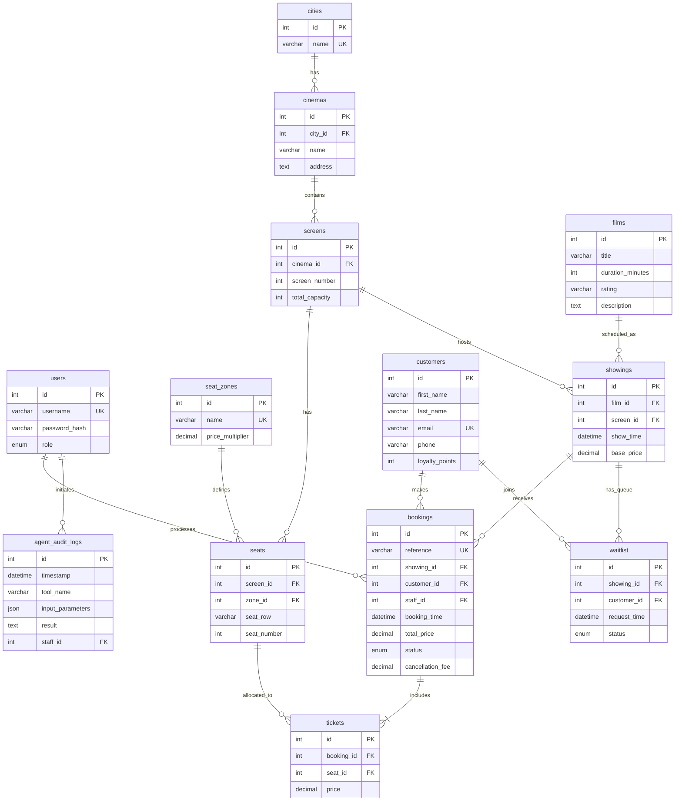

# HCBS Database Schema Design

This document details the database schema for the Horizon Cinemas Booking System (HCBS), including tables, constraints, relationships, and an Entity-Relationship diagram.

## 1. Tables & Columns

### `users`
Stores system users with their roles and hashed passwords for authentication.
*   `id` (INT, PRIMARY KEY, AUTO_INCREMENT)
*   `username` (VARCHAR, UNIQUE, NOT NULL)
*   `password_hash` (VARCHAR, NOT NULL)
*   `role` (ENUM('Manager', 'Admin', 'Staff'), NOT NULL)

### `cities`
Stores the cities where Horizon Cinemas operates.
*   `id` (INT, PRIMARY KEY, AUTO_INCREMENT)
*   `name` (VARCHAR, UNIQUE, NOT NULL) - e.g., 'Birmingham', 'Bristol', 'Cardiff', 'London'

### `cinemas`
Stores cinema locations within cities.
*   `id` (INT, PRIMARY KEY, AUTO_INCREMENT)
*   `city_id` (INT, FOREIGN KEY references `cities.id`, NOT NULL)
*   `name` (VARCHAR, NOT NULL)
*   `address` (TEXT, NOT NULL)

### `screens`
Stores individual screens inside each cinema. Capacities range from 50 to 120.
*   `id` (INT, PRIMARY KEY, AUTO_INCREMENT)
*   `cinema_id` (INT, FOREIGN KEY references `cinemas.id`, NOT NULL)
*   `screen_number` (INT, NOT NULL)
*   `total_capacity` (INT, NOT NULL) - Constraint: 50 <= total_capacity <= 120

### `seat_zones`
Defines the different types of seating and their pricing multipliers.
*   `id` (INT, PRIMARY KEY, AUTO_INCREMENT)
*   `name` (VARCHAR, UNIQUE, NOT NULL) - 'Lower Hall', 'Upper Gallery', 'VIP'
*   `price_multiplier` (DECIMAL, NOT NULL) - 1.0 for Lower Hall, 1.2 for Upper Gallery, 1.44 for VIP (20% more than Upper Gallery)

### `seats`
Stores all physical seats for every screen, mapped to a specific zone.
*   `id` (INT, PRIMARY KEY, AUTO_INCREMENT)
*   `screen_id` (INT, FOREIGN KEY references `screens.id`, NOT NULL)
*   `zone_id` (INT, FOREIGN KEY references `seat_zones.id`, NOT NULL)
*   `seat_row` (VARCHAR(2), NOT NULL)
*   `seat_number` (INT, NOT NULL)
*   *Constraint*: UNIQUE(`screen_id`, `seat_row`, `seat_number`)

### `films`
Stores information about movies.
*   `id` (INT, PRIMARY KEY, AUTO_INCREMENT)
*   `title` (VARCHAR, NOT NULL)
*   `duration_minutes` (INT, NOT NULL)
*   `rating` (VARCHAR, NOT NULL)
*   `description` (TEXT)

### `showings`
Stores scheduled movie screenings. Price varies by city and time (morning, afternoon, evening).
*   `id` (INT, PRIMARY KEY, AUTO_INCREMENT)
*   `film_id` (INT, FOREIGN KEY references `films.id`, NOT NULL)
*   `screen_id` (INT, FOREIGN KEY references `screens.id`, NOT NULL)
*   `show_time` (DATETIME, NOT NULL)
*   `base_price` (DECIMAL, NOT NULL) - The price for a 'Lower Hall' seat for this specific show.

### `customers`
Stores customer details and tracks loyalty points.
*   `id` (INT, PRIMARY KEY, AUTO_INCREMENT)
*   `first_name` (VARCHAR, NOT NULL)
*   `last_name` (VARCHAR, NOT NULL)
*   `email` (VARCHAR, UNIQUE, NOT NULL)
*   `phone` (VARCHAR, NOT NULL)
*   `loyalty_points` (INT, DEFAULT 0)

### `bookings`
Stores reservation records made by staff on behalf of customers.
*   `id` (INT, PRIMARY KEY, AUTO_INCREMENT)
*   `reference` (VARCHAR, UNIQUE, NOT NULL) - Format: HCBS-YYYYMMDD-XXXX
*   `showing_id` (INT, FOREIGN KEY references `showings.id`, NOT NULL)
*   `customer_id` (INT, FOREIGN KEY references `customers.id`, NOT NULL)
*   `staff_id` (INT, FOREIGN KEY references `users.id`, NOT NULL) - The staff member who processed it
*   `booking_time` (DATETIME, DEFAULT CURRENT_TIMESTAMP)
*   `total_price` (DECIMAL, NOT NULL)
*   `status` (ENUM('Active', 'Cancelled'), DEFAULT 'Active')
*   `cancellation_fee` (DECIMAL, DEFAULT 0.00)

### `tickets`
Stores individual tickets for a booking, mapping one ticket to one seat.
*   `id` (INT, PRIMARY KEY, AUTO_INCREMENT)
*   `booking_id` (INT, FOREIGN KEY references `bookings.id`, NOT NULL)
*   `seat_id` (INT, FOREIGN KEY references `seats.id`, NOT NULL)
*   `price` (DECIMAL, NOT NULL) - Actual price paid (base_price * zone multiplier)
*   *Constraint*: UNIQUE(`showing_id` via booking, `seat_id`) to prevent double-booking.

### `waitlist`
Stores queue of customers waiting for cancellations on a full showing.
*   `id` (INT, PRIMARY KEY, AUTO_INCREMENT)
*   `showing_id` (INT, FOREIGN KEY references `showings.id`, NOT NULL)
*   `customer_id` (INT, FOREIGN KEY references `customers.id`, NOT NULL)
*   `request_time` (DATETIME, DEFAULT CURRENT_TIMESTAMP)
*   `status` (ENUM('Waiting', 'Notified', 'Expired'), DEFAULT 'Waiting')

### `agent_audit_logs`
Logs actions taken by the LLM Agent for security and debugging.
*   `id` (INT, PRIMARY KEY, AUTO_INCREMENT)
*   `timestamp` (DATETIME, DEFAULT CURRENT_TIMESTAMP)
*   `tool_name` (VARCHAR, NOT NULL) - e.g., 'book_ticket', 'cancel_booking'
*   `input_parameters` (JSON, NOT NULL)
*   `result` (TEXT, NOT NULL)
*   `staff_id` (INT, FOREIGN KEY references `users.id`, NULL) - The staff member interacting with the agent.

---

## 2. Relationships

*   **City to Cinema (One-to-Many):** A city contains multiple cinemas. A cinema belongs to exactly one city.
*   **Cinema to Screen (One-to-Many):** A cinema has multiple screens (up to 6). A screen belongs to exactly one cinema.
*   **Screen to Seat (One-to-Many):** A screen contains many seats (50-120). A seat belongs to exactly one screen.
*   **Seat Zone to Seat (One-to-Many):** A seat zone (Lower Hall, etc.) applies to many seats. A seat has exactly one zone.
*   **Film to Showing (One-to-Many):** A film can have many showings. A showing is for exactly one film.
*   **Screen to Showing (One-to-Many):** A screen hosts many showings at different times. A showing occurs in exactly one screen.
*   **Showing to Booking (One-to-Many):** A showing can have many bookings. A booking is for exactly one showing.
*   **Customer to Booking (One-to-Many):** A customer can make many bookings. A booking belongs to exactly one customer.
*   **User (Staff) to Booking (One-to-Many):** A staff member processes many bookings. A booking is processed by exactly one staff member.
*   **Booking to Ticket (One-to-Many):** A booking contains one or more tickets. A ticket belongs to exactly one booking.
*   **Seat to Ticket (One-to-Many):** Over time, a physical seat can be associated with many tickets (for different shows), but only one active ticket per showing.
*   **Showing to Waitlist (One-to-Many):** A showing can have many people on the waitlist. A waitlist entry is for exactly one showing.
*   **Customer to Waitlist (One-to-Many):** A customer can be on the waitlist for multiple showings. A waitlist entry belongs to exactly one customer.
*   **User (Staff) to Agent Audit Log (One-to-Many):** A staff member can trigger multiple LLM agent actions. An audit log corresponds to the staff member who initiated the prompt.

---

## 3. Entity-Relationship Diagram (Mermaid)

